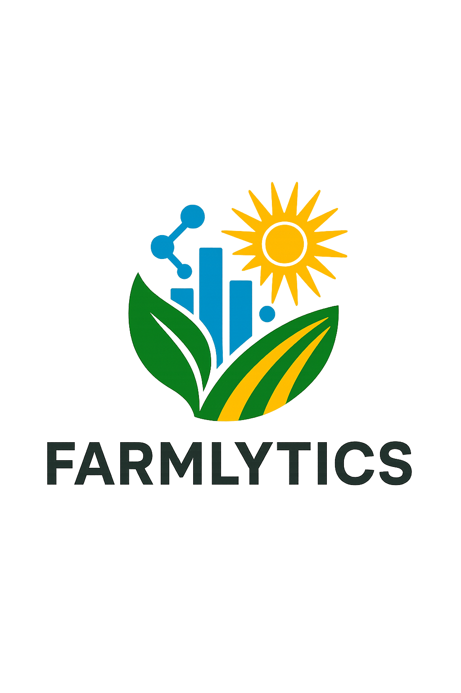

# 🌾 Farmlytics Mobile App

 <!-- Ensure you have a logo.png in your /assets directory -->

Welcome to the official repository for the **Farmlytics Mobile App**! Designed to empower Rwandan farmers, this application provides data-driven insights to optimize crop planning, enhance market access, and streamline harvest tracking. Our goal is to bring modern agricultural intelligence directly to their fingertips, fostering increased productivity and prosperity.

This mobile app is the frontend companion to the [Farmlytics Backend API](https://farmlytics1-1.onrender.com/api-docs/).

---

## **Table of Contents**

1.  [✨ Features](#-features)
2.  [💻 Tech Stack](#-tech-stack)
3.  [🎨 Design & Branding](#-design--branding)
4.  [🚀 Get Started](#-get-started)
    *   [Installation](#installation)
    *   [Configuration](#configuration)
    *   [Running the App](#running-the-app)
5.  [📦 Install APK (Android)](#-install-apk-android)
6.  [📖 User Guide](#-user-guide)
7.  [🗺️ Project Roadmap](#-project-roadmap)
8.  [🤝 Contributing](#-contributing)
9.  [📄 License](#-license)

---

## **✨ Features**

Farmlytics Mobile offers a robust suite of functionalities:

*   **Intuitive & Modern UI:** A sleek, mobile-first design with fluid animations and consistent theming.
*   **Multi-language Support:** Seamlessly switch between English, Kinyarwanda (RW), and French (FR) directly from the app header.
*   **Secure Authentication:** User registration, login, and JWT-based authentication with email verification.
*   **Personalized Dashboard:** A quick overview of upcoming harvests, top local market demand, and essential quick links.
*   **Crop Planner:**
    *   **Recommendations:** Get tailored crop recommendations, estimated yields, and area allocations based on district and farm size.
    *   **Input Forms:** User-friendly forms for data entry.
*   **Market Insights:**
    *   **Local Demand:** Explore high-demand crops and consumption patterns in specific districts or provinces.
    *   **Connections:** Identify nearby agricultural cooperatives, potential buyers, food processors, and export-oriented businesses.
*   **Harvest Tracker:**
    *   **Plan Management:** Full CRUD (Create, Read, Update, Delete) operations for farmer-specific crop planting records.
    *   **Dynamic Estimates:** View real-time estimates for harvest dates, total production, and potential revenue.
*   **User Profile:** Access and manage personal account information.
*   **Advanced Header:** A dynamic header with back navigation, app branding, and an integrated language switcher.
*   **Pull-to-Refresh:** Data-heavy screens include pull-to-refresh for up-to-date information.

---

## **💻 Tech Stack**

*   **Frontend:**
    *   [**React Native**](https://reactnative.dev/): Cross-platform native mobile development.
    *   [**Expo**](https://expo.dev/): Powerful toolchain for React Native development and deployment.
    *   [**TypeScript**](https://www.typescriptlang.org/): For robust, type-safe code.
    *   [**`styled-components`**](https://styled-components.com/): CSS-in-JS for flexible and themeable styling.
    *   [**`react-navigation`**](https://reactnavigation.org/): Declarative navigation for React Native apps.
    *   [**`react-i18next`**](https://react.i18next.com/) & [**`expo-localization`**](https://docs.expo.dev/versions/latest/sdk/localization/): Comprehensive internationalization.
    *   [**`expo-linear-gradient`**](https://docs.expo.dev/versions/latest/sdk/linear-gradient/) & [**`react-native-reanimated`**](https://docs.swmansion.com/react-native-reanimated/): For smooth animations and dynamic UI.
    *   [**`@react-native-picker/picker`**](https://github.com/react-native-picker/picker) & [**`react-native-modal-datetime-picker`**](https://github.com/react-native-community/datetimepicker): Enhanced form inputs.
    *   [**`@react-native-async-storage/async-storage`**](https://github.com/react-native-async-storage/async-storage): Secure client-side data storage.
    *   [**`@expo/vector-icons`**](https://icons.expo.fyi/): Extensive icon library.
    *   [**`react-native-safe-area-context`**](https://github.com/th3rdwave/react-native-safe-area-context): Handles device-specific safe areas.
*   **Backend:** (Refer to the [Farmlytics Backend API Documentation](https://farmlytics1-1.onrender.com/api-docs/))
    *   Node.js, Express.js, MongoDB, Mongoose, JWT.

---

## **🎨 Design & Branding**

The Farmlytics mobile app's design is inspired by the vibrant colors of the Rwandan flag, creating a visually appealing and culturally resonant experience.

*   **Rwandan Flag Color Palette:**
    *   **Primary Blue (`#00A1DE`):** Peace & tranquility.
    *   **Secondary Yellow (`#FDC400`):** Economic development & prosperity.
    *   **Tertiary Green (`#23B24F`):** Hope & natural resources.
    *   **Dark Green (`#187B3D`):** Used for gradients and deeper accents.
*   **Advanced UI/UX Principles:**
    *   **Consistent Theming:** All UI elements adhere to a centralized theme.
    *   **Dynamic Headers:** Branded headers with integrated language switching.
    *   **Animated Interactions:** Subtle animations for a modern and engaging user experience.
    *   **Card-based Layouts:** Clean, readable presentation of information.

---

## **🚀 Get Started**

Follow these instructions to set up and run the Farmlytics mobile app on your local development environment.

### **Installation**

1.  **Clone the repository:**
    ```bash
    git clone https://github.com/Muhinde234/farmlytics-mobile.git # Replace with your actual mobile app repo URL
    cd farmlytics-mobile
    ```
2.  **Install npm dependencies:**
    ```bash
    npm install
    ```
3.  **For iOS development (if using a Mac):**
    ```bash
    cd ios && pod install && cd ..
    ```

### **Configuration**

1.  **Create a `.env` file:** In the root of your project (`farmlytics-mobile/`), create a file named `.env`.
2.  **Add your backend API URL:**
    ```
    EXPO_PUBLIC_API_BASE_URL=https://farmlytics1-1.onrender.com/api/v1
    ```
    *   If running your backend locally, replace the URL with your local backend address (e.g., `http://localhost:5000/api/v1`).
3.  **Add your logo:** Place your `logo.png` file in the `assets/` directory at the project root. This is used for branding throughout the app.

### **Running the App**

1.  **Start the Expo development server:**
    ```bash
    npm start
    # or
    expo start
    ```
    This will open the Expo Dev Tools in your web browser.
2.  **Run on a device or emulator:**
    *   **Scan QR Code:** Download the [Expo Go app](https://expo.dev/client) on your Android or iOS device and scan the QR code from the terminal or Expo Dev Tools.
    *   **Android Emulator:** Press `a` in the terminal.
    *   **iOS Simulator:** Press `i` in the terminal (macOS only).

---

## **📦 Install APK (Android)**

You can install a standalone Android Package Kit (APK) of the Farmlytics app directly onto your Android device.

**Current Version: 1.0.0**

**[➡️ Download Farmlytics Mobile APK here](https://example.com/farmlytics-mobile-v1.0.0.apk)** *(Placeholder link - replace with actual APK download URL)*

**How to Install the APK:**

1.  Download the APK file to your Android device.
2.  You may need to enable "Install unknown apps" in your device's security settings for your browser or file manager.
3.  Locate the downloaded APK file (typically in your "Downloads" folder) and tap it to start the installation.
4.  Follow the on-screen prompts.

---

## **8. User Guide**

### **Multi-language Support**

*   **Seamless Switching:** The app intelligently detects your device's primary language. If supported (English, Kinyarwanda, French), it will load automatically.
*   **Global Access:** Change the language anytime by tapping the **globe icon (🌍)** in the header on any main screen. A modal will appear, allowing you to select your preferred language.
*   **Persistent Choice:** Your chosen language is saved for future app launches.

### **Authentication Flow**

1.  **Splash Screen:** An animated welcome.
2.  **Welcome Screen:** Select your language (via header) and choose to `Login` or `Register`.
3.  **Login:** Enter credentials. An alert will notify you if email verification is pending or if credentials are incorrect.
4.  **Register:** Provide name, email, password, and select your `role` (Farmer or Buyer). A verification email will be sent.

### **Main App Navigation (Bottom Tabs)**

After successful login, navigate easily using the bottom tab bar:

*   **🏠 Home:** Your personalized dashboard.
*   **🌱 Planner:** Get crop recommendations.
*   **📊 Market:** Explore market insights.
*   **🗓️ Tracker:** Manage your crop plans.
*   **👤 Profile:** View/manage your account.

### **Home Screen (Dashboard)**

Your personalized central hub:

*   **Dynamic Welcome:** Animated greeting with your name and a custom tagline.
*   **Next Harvest:** View details of your upcoming planted crop plan. Tap to see full details.
*   **Top Market Demand:** See the highest-demanded crop in your area. Tap to explore more market insights.
*   **Quick Links Grid:** Quick access to the Planner, Market, and Tracker modules.
*   **Pull-to-Refresh:** Always stay updated with the latest data.

### **Crop Planner**

Plan your next planting with intelligent recommendations:

*   **Input Form:** Select your `District` and enter your `Farm Size (Hectares)`.
*   **Generate Plan:** Tap to receive tailored recommendations.
*   **Recommendations:** View a list of suggested crops, each with `Recommended Area`, `Estimated Yield`, and `Estimated Total Production`.
*   **Clear Feedback:** User-friendly messages for validation errors, successful fetches, or no data found.

### **Market Insights**

Connect with the market and understand demand:

*   **Location Filter:** Select a `Location Type` (District/Province) and the `Location Name`.
*   **Insights Categories:** Sections for:
    *   **Top Demand Crops:** Key crops by consumption.
    *   **Cooperatives:** Agricultural cooperatives in the area.
    *   **Buyers & Processors:** Potential buyers and food processing businesses.
    *   **Exporters:** Companies involved in exporting.
*   **Detailed Views:** Each entry shows relevant details like economic activity, number of workers, and annual turnover.

### **Harvest Tracker**

Manage and monitor your crop cycles:

*   **My Crop Plans List:** View all your tracked crop plans, with status and key dates. Tap to see details.
*   **Add New Plan:** A form to create new crop plans, including `Crop Name`, `District`, `Area Planted`, `Planting Date`, and `Status`.
*   **Crop Plan Details:**
    *   **Comprehensive View:** All submitted details and dynamically generated `Live Estimates` (yield, production, price, revenue, harvest date).
    *   **Edit Plan:** Modify existing plan details.
    *   **Delete Plan:** Permanently remove a crop plan (with confirmation).

### **Profile Screen**

Your personal settings and account overview:

*   **Account Info:** Displays your `Name`, `Email`, and `Role`.
*   **Email Verification Status:** Clearly indicates if your email is verified.
*   **Language Settings:** Integrated `Language Selector` for convenient language changes.
*   **Logout:** A prominent button to securely log out.

---

## **🗺️ Project Roadmap**

Our vision for Farmlytics extends far beyond the current MVP:

*   **Real-time Market Prices:** Integrate live price feeds for even more accurate revenue forecasting.
*   **Weather & Soil Data:** Incorporate hyper-local weather forecasts and soil analysis for advanced crop planning.
*   **Advanced Analytics & ML:** Implement machine learning models for dynamic yield prediction, risk assessment, and optimal planting windows.
*   **Buyer/Cooperative Contact Management:** Secure in-app communication and contact sharing with market players.
*   **Push Notifications:** Timely alerts for critical events (upcoming harvests, market shifts, weather warnings).
*   **Offline Capabilities:** Basic functionality and data access even without internet.
*   **Farmer/Buyer Profiles:** Enhanced profile management with more customizable options.

---

## **🤝 Contributing**

We welcome contributions to make Farmlytics even better! If you're interested in contributing:

1.  Fork the repository.
2.  Create a new branch (`git checkout -b feature/your-feature-name`).
3.  Make your changes and ensure consistent styling and functionality.
4.  Commit your changes (`git commit -m 'feat: Add new feature X'`).
5.  Push to the branch (`git push origin feature/your-feature-name`).
6.  Open a Pull Request with a clear description of your changes.

---

## **📄 License**

This project is licensed under the MIT License. See the [LICENSE](LICENSE) file for details.