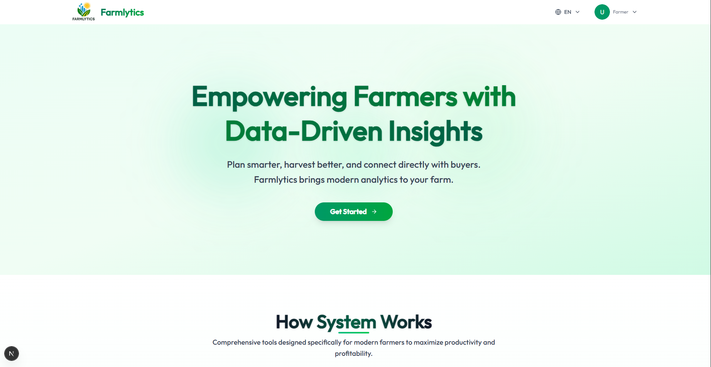

# 🌾 **Farmlytics — Empowering Rwandan Farmers Through Data**

> 🚀 A next-generation web app built with **Next.js**, **TypeScript**, **Tailwind CSS**, **TanStack**, and **Framer Motion**, designed to help Rwandan farmers plan crops, track harvests, understand potential crop diseases, and connect to markets — with full **multi-language support**.


## 🌟 **Overview**

**Farmlytics** transforms Rwanda’s open agricultural data into **actionable, localized insights**.
Through a multilingual, visually engaging web interface, it helps farmers make data-driven decisions by:

* 📊 Planning crops based on their district and land size
* 🌍 Exploring high-demand crops locally and internationally
* 💰 Tracking harvests and estimating revenue
* 🧭 Visualizing yield, disease risk, and market trends
* 🩺 Learning about common diseases that may affect their crops

The platform ensures **speed, inclusivity, and accessibility**, empowering both farmers and market buyers to make better, informed decisions — in **English**, **Kinyarwanda**, or **French**.

---

## 🧠 **Core Features**

| Feature                       | Description                                                                             |
| ----------------------------- | --------------------------------------------------------------------------------------- |
| 🌱 **Crop Planner**           | Personalized crop recommendations based on district and farm size                       |
| 📈 **Market Insights**        | Real-time data visualization of high-demand and exportable crops                        |
| 📅 **Harvest Tracker**        | Log, track, and manage planted crops and expected yields                                |
| 🧩 **Reusable Components**    | Consistent and maintainable UI across all pages                                         |
| ✨ **Smooth Animations**       | Enhanced user experience using **Framer Motion**                                        |
| 🌐 **Multi-Language Support** | Seamless language switching with **Next-Intl** (Kinyarwanda, English, French)           |
| 🩺 **Crop Disease Awareness** | Displays common diseases affecting each crop and preventive measures (not AI detection) |
| 📊 **Visual Insights**        | Interactive charts and maps powered by **TanStack** and **Recharts**                    |

---

## 🧰 **Tech Stack**

| Layer             | Tools                                                                                     |
| ----------------- | ----------------------------------------------------------------------------------------- |
| **Framework**     | [Next.js 14+](https://nextjs.org/) — SSR, API routes, and multilingual routing            |
| **Language**      | [TypeScript](https://www.typescriptlang.org/) — for robust, scalable development          |
| **Styling**       | [Tailwind CSS](https://tailwindcss.com/) — utility-first, responsive design system        |
| **Data Handling** | [TanStack Query](https://tanstack.com/query/latest) — efficient data fetching and caching |
| **Animations**    | [Framer Motion](https://www.framer.com/motion/) — smooth transitions and motion effects   |
| **Charts**        | [Recharts](https://recharts.org/en-US) — powerful data visualization library              |
| **Localization**  | [Next-Intl](https://next-intl-docs.vercel.app/) — dynamic internationalization            |
| **Deployment**    | [Vercel](https://vercel.com/) — automatic builds and instant global deployment            |

---

## ⚙️ **Installation & Setup**

### 1. Clone the repository

```bash
git clone https://github.com/Muhinde234/farmlytics
cd farmlytics-frontend
```

### 2. Install dependencies

```bash
npm install
```

### 3. Run the development server

```bash
npm run dev
```

> Open [http://localhost:3000](http://localhost:3000) in your browser to view the app.

---

## 🧩 **Project Structure**
farmlytics-frontend/
├── .next/                    # Next.js build output
├── node_modules/             # Installed dependencies
├── public/                   # Static assets (images, icons, translations)
├── src/                      # Main source folder
│   ├── api/                  # API routes and data fetching logic
│   ├── app/                  # App Router pages, layouts, and routes
│   ├── components/           # Reusable UI and functional components
│   ├── context/              # Global state management using React Context
│   ├── helpers/              # Utility and helper functions
│   ├── hooks/                # Custom React hooks (TanStack Query, state logic)
│   ├── i18n/                 # Internationalization configuration (Next-Intl)
│   ├── lib/                  # Shared utilities, constants, or data logic
│   ├── messages/             # Translation message files for supported languages
│   └── middleware.ts         # Middleware for locale redirection and routing
│
├── .env                      # Environment variables
├── .gitignore                # Git ignore rules
├── eslint.config.mjs         # ESLint configuration
├── next-env.d.ts             # Next.js TypeScript definitions
├── next.config.ts            # Next.js configuration (i18n, SSR, etc.)
├── package.json              # Dependencies and scripts
├── package-lock.json         # Locked dependency versions
├── postcss.config.mjs        # PostCSS configuration for Tailwind
├── tsconfig.json             # TypeScript compiler configuration
└── README.md                 # Project documentation


## 🌍 **Key Design Principles**

1. **Reusability First** — Every UI element is modular and composable.
2. **Motion as Feedback** — Subtle transitions guide users naturally.
3. **Data-Driven UI** — Live, cache-optimized data fetching for seamless UX.
4. **Accessible to All** — Simple layouts for low-digital-literacy users.
5. **Localization Built-In** — Full multilingual support across UI and data.
6. **Preventive Crop Health** — Inform farmers about diseases before they strike.

---

## 🩺 **Crop Disease Awareness Module**

Unlike AI-based disease detection tools, Farmlytics focuses on **education and prevention**:

* Displays **common diseases** that may affect each crop (e.g., Cassava Mosaic, Potato Blight, Maize Rust).
* Offers **visual info and brief descriptions** about symptoms and prevention methods.
* Helps farmers take **precautionary measures** early in the crop cycle.
* Designed to complement the crop planner — so users know what risks to prepare for before planting.

---

## 📊 **Visual Insights**

Farmlytics integrates **Recharts** and **Framer Motion** for clear, interactive visuals:

* Dynamic **yield and market trend** charts
* Animated transitions for smooth dashboard interactions
* Interactive **disease awareness visuals** and info cards

---

## 🚀 **Deployment**

Deployed on **Vercel** for continuous delivery and real-time updates:

```bash
npm run build
npm run start
```

> 🌐 Production build optimized for performance, multilingual SEO, and fast access.

---

## 💡 **Impact**

* 🌾 Empowers farmers with **data-driven crop planning**
* 💵 Connects farmers with **markets and cooperatives**
* 🧬 Educates farmers about **crop diseases and prevention**
* 📈 Promotes **sustainable, resilient agriculture**
* 🧑‍💻 Encourages **youth innovation and open-data use**

---

## 🏆 **Why Farmlytics Stands Out**

* Built with **industry-grade technologies and architecture**
* Delivers **real value** — from planning to disease prevention and marketing
* Supports **multi-language and inclusive design** for Rwandan communities
* Prioritizes **reusability, accessibility, and data visualization**
* Designed to **scale** across regions, crops, and languages

---

## 🤝 **Contributors**

**Team Farmlytics**
Developed with ❤️ by innovators passionate about agriculture, data, and technology for Rwanda’s digital future.

---


